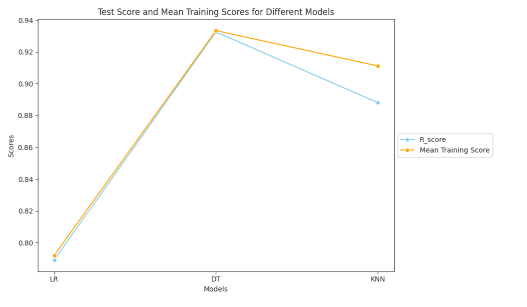
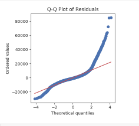
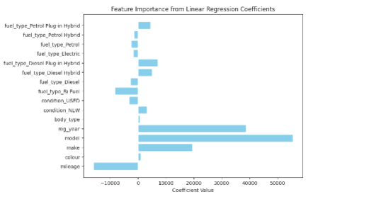
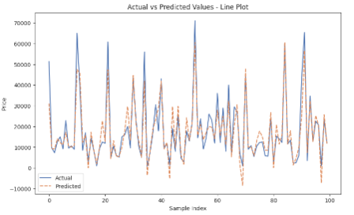

# 🚗 Vehicle Price Prediction using Machine Learning

Welcome to the repository for my Machine Learning coursework project for **Unit 6G7V0015 – Machine Learning Concepts** at MMU. This end-to-end solution tackles a **real-world regression task**: predicting the selling price of vehicles based on historical car advertisement data provided by **AutoTrader**.

---

## 📁 Project Structure

📦 Vehicle-Price-Prediction/

├── 📜 mlp_code.py         → Complete machine learning pipeline script

├── 📦 adverts.csv.zip     → Compressed dataset (large file)

├── 📄 report.pdf          → Final coursework report with visual insights

├── 📘 README.md           → Project documentation (you're here!)


📂 Note: The dataset is also available as a Google Sheet 📎

---

## 📊 Project Overview

### 🎯 Objective
Develop, evaluate, and compare predictive models for vehicle pricing using historical ad data. The task simulates the work of machine learning engineers at AutoTrader, enhancing user pricing transparency.

### 🧠 Techniques Used
- **Exploratory Data Analysis (EDA)**
- **Feature Engineering & Encoding**
- **Data Cleaning & Outlier Handling**
- **Model Training & Tuning (Linear, Decision Tree, kNN)**
- **Validation, Testing, & Residual Analysis**
- **Model Comparison & Feature Importance**

---

## 🔍 Dataset Description

- ~400,000 anonymized vehicle advertisements
- Includes: make, model, mileage, fuel type, registration year, vehicle condition, price, etc.

📌 Source: AutoTrader UK, shared through institutional access
🔒 Note: This dataset was provided under a non-commercial academic-use license. It is not redistributed in this repository. All results, code, and visualizations are derived from this dataset in compliance with those terms.


---

## 🧪 Models Implemented

| Model               | Techniques Used                        | Tools & Metrics |
|--------------------|-----------------------------------------|-----------------|
| 📈 Linear Regression | Feature scaling, residuals analysis     | R², MAE, MSE     |
| 🌲 Decision Tree     | GridSearchCV tuning, feature importance | R², MAE, MSE     |
| 🤖 K-Nearest Neighbors | Distance-based, sampling optimization   | R², MAE, MSE     |

✅ All models are evaluated on **training**, **validation**, and **test sets**, with CV analysis included.

---

## 📉 Results Summary

- **Best performance**: Decision Tree with tuned hyperparameters
- Included:
  - Actual vs Predicted plots
  - Residual distributions
  - Feature importances (tree & regression coefficients)
  - Visual model comparison using bar and line plots

---

### 📸 Visual Insights
A series of diagnostic plots were generated for the Linear Regression model to assess its assumptions and performance:

### 🔹 Residual Distribution (Linear Regression)
This plot shows the distribution of residuals (errors) from the linear regression model. A sharp peak near zero indicates a generally good fit, but slight right skew suggests some under-predicted values.


### 🔹 Q-Q Plot of Residuals
The Q-Q plot compares the residuals to a normal distribution. Significant curvature and deviation from the diagonal line suggest non-normality in the residuals — a violation of linear regression assumptions.



### 🔹 Feature Importance (Linear Regression Coefficients)
This bar plot shows which features had the largest positive or negative impact on vehicle price according to the linear regression model. Features like `model`, `reg_year`, and `body_type` are strong predictors.



### 🔹 Actual vs Predicted Values (Line Plot)
A line plot comparing actual and predicted prices for a sample of 100 vehicles. A close alignment between lines indicates strong predictive performance, especially in low- and mid-price ranges.



---


## 🛠 Tech Stack

- `Python 3.10+`
- `Pandas`, `NumPy`, `Seaborn`, `Matplotlib`
- `Scikit-Learn`, `category_encoders`
- Google Colab / Jupyter Notebook

---

## 📎 How to Reproduce

1. Clone the repo:
   ```bash
   git clone https://github.com/yourusername/vehicle-price-prediction.git
   cd vehicle-price-prediction
Install dependencies:
pip install -r requirements.txt
Load the notebook or run mlp_code.py:
python mlp_code.py
⚠️ Note: If using Google Colab, ensure you mount your Drive and place adverts.csv appropriately.

## 📚 Report & Evaluation
The full PDF report is included in this repo, containing:

Code snippets + outputs

Explanations per spec requirement

Model evaluation

Visualizations

Reflections

## Author:

Tooba Zahid
